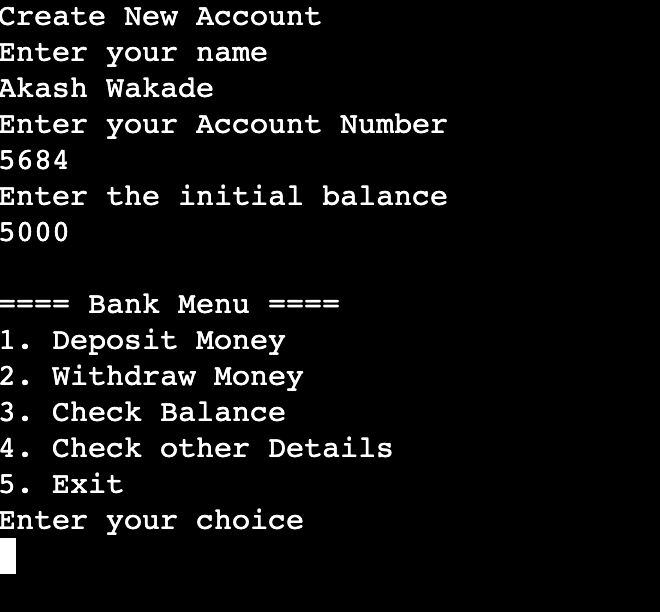
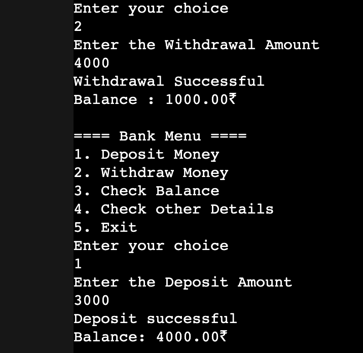

<div align="center">

# 💳 Simple Banking System (Java)


</div>

A **console-based banking system** built using **Java** that simulates basic banking operations such as creating an account, depositing money, withdrawing money, and checking account details.

This project was built to practice **core Java fundamentals and Object-Oriented Programming (OOP)** concepts.


---

## 📸 Project Preview

### Main Menu



### Example Output



---

## ✨ Features

- Create a new bank account
- Deposit money
- Withdraw money
- Check account balance
- View account details
- Menu-driven console interface

---

## 🧠 Concepts Used

This project demonstrates several important Java concepts:

- Classes and Objects
- Methods and Parameters
- Object-Oriented Programming (OOP)
- User Input using `Scanner`
- Conditional Statements (`if-else`)
- `switch` Statements
- `do-while` Loop

---

## 🛠 Tech Stack

- **Language:** Java
- **Interface:** Console / Terminal
- **Concepts:** Object-Oriented Programming

---

## 📂 Project Structure

```
SIMPLE-BANKING-SYSTEM
│
├── assets
│   ├── Preview-1.png
│   └── Preview-2.png
│
├── Main.java
└── README.md
```

---

## 📄 File Overview

### **Main.java**

- Entry point of the application
- Handles user interaction
- Displays the banking menu
- Calls banking operations from the `BankAccount` class

### **BankAccount.java**

- Stores account information
- Implements core banking operations:
  - Deposit money
  - Withdraw money
  - Check balance
  - Display account details

### **assets/**

Contains preview images used in the README.

---

## ⚙️ How to Run the Project

### 1️⃣ Compile the program

```bash
javac Main.java
```

### 2️⃣ Run the program

```bash
java Main
```

---

## 💡 Example Menu

```
==== Bank Menu ====

1. Deposit Money
2. Withdraw Money
3. Check Balance
4. Check Account Details
5. Exit
```

---

## 🚀 Future Improvements

Possible upgrades for this project:

- Add **PIN-based authentication**
- Support **multiple bank accounts**
- Add **transaction history**
- Store account data using **files or a database**
- Build a **GUI version using Java Swing or JavaFX**

---

## 👨‍💻 Author

**Akash Wakade**
Computer Science Student | Java & Web Development

---

⭐ **Read the Linkden Post:**  
👉 https://www.linkedin.com/feed/update/urn:li:activity:7436766122026336256/

⭐ **Read the documentation:**  
👉 https://akash-wakade-7008-alt.github.io/Simple-Banking-System/


